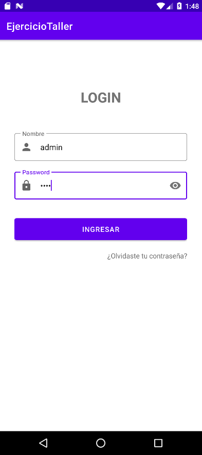
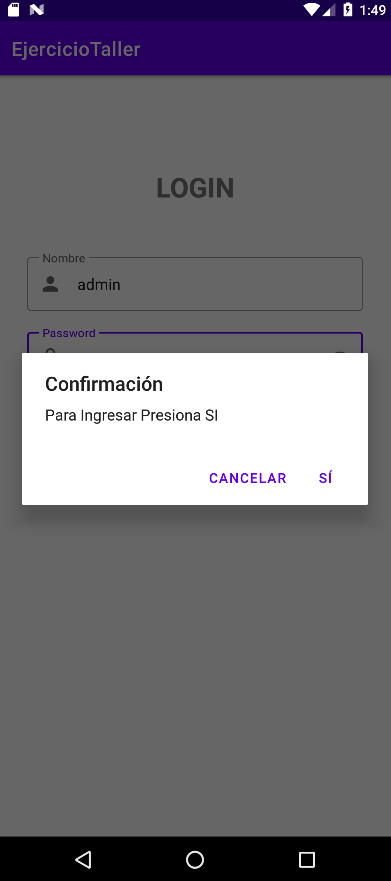
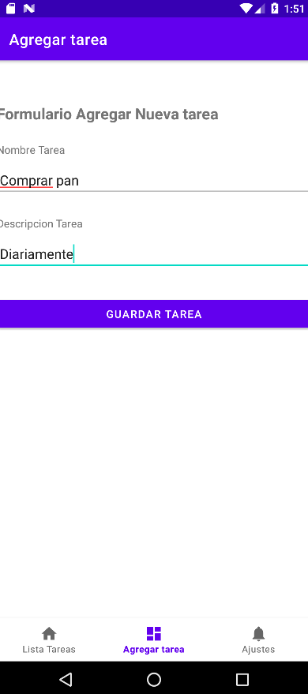
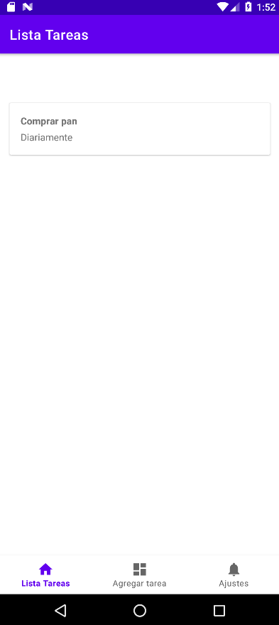
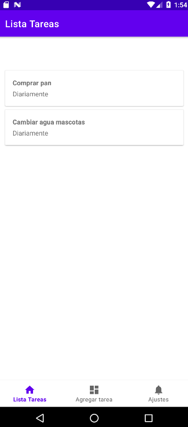

# 📝 TareasApp: Gestor de Tareas con Navegación Avanzada

## ✨ Descripción del Proyecto

**TareasApp** es una aplicación móvil desarrollada para demostrar la implementación de patrones de navegación complejos (Bottom Tab y Stack Navigation) junto con la gestión de datos mediante formularios y visualización dinámica en listas.

El objetivo central es proporcionar una herramienta simple que permita a los usuarios organizar, añadir y visualizar sus tareas pendientes.

## 🔑 Funcionalidades Clave Implementadas

El proyecto se estructura alrededor de tres funcionalidades principales:

### 1. 🧭 Navegación Estructurada
La aplicación utiliza una **barra de navegación inferior (Bottom Tab Navigation)** que permite el acceso rápido a tres secciones principales:

* **🏠 Inicio (Lista de Tareas):** Muestra todas las tareas guardadas.
* **➕ Agregar Tarea:** Contiene el formulario para la creación de nuevas tareas.
* **⚙️ Ajustes:** Una pantalla de ejemplo con texto simple.

Además, implementa **Stack Navigation** para:
* **Detalle de Tarea:** Al tocar un ítem de la lista, se navega a una pantalla separada que muestra el título y la descripción completa de la tarea.

### 2. ➕ Gestión de Tareas
Se incluye un **formulario completo** en la sección "Agregar Tarea" para la toma de datos:
* Campo de texto para el **título** de la tarea.
* Campo de texto para la **descripción** detallada.
* Botón de **guardar** que procesa y añade la tarea a la lista.

### 3. 📊 Visualización Dinámica
* La pantalla de Inicio utiliza un componente de lista dinámica (`LazyColumn`, `ListView` o `GridView`) para mostrar todas las tareas añadidas.
* Se implementan **clases y/o modelos de datos** para estructurar la información de cada tarea (título, descripción).

## 🛠️ Tecnologías Utilizadas

* **Lenguaje:** [Kotlin / Java]
* **Framework/SDK:** Android SDK (API [Número de API])
* **Componentes de UI:** [TextField, Button, LazyColumn/ListView]
* **Estructura de Datos:** Implementación de Clases para la gestión de modelos de datos.

## 🚀 Cómo Ejecutar el Proyecto

1.  **Clona el Repositorio:**
    ```bash
    git clone [https://github.com/stzupa/taller-Android-bottom-y-stack.git](https://github.com/stzupa/taller-Android-bottom-y-stack.git)
    ```
2.  **Abre en Android Studio:**
    Selecciona `File > Open` y abre la carpeta clonada.
3.  **Sincroniza y Ejecuta:**
    Permite que Gradle sincronice las dependencias y ejecuta el proyecto en un emulador o dispositivo físico.

## 🧑‍💻 Contribuciones

Siéntete libre de forkar (fork) el proyecto, proponer mejoras o reportar errores.

---
## 📸 Vistas de la Aplicación
### 1 Pantalla inicial (Credenciales)
Muestra pantalla para ingreso de las credenciales


### 2. Login
Ingreso a la aplicación


### 3. Formulario "Agregar Tarea"
Aquí es donde el usuario ingresa el título y la descripción de una nueva tarea.


### 4. Listado de tareas ingresadas
Muestra la lista de las tareas ingresadas


### 5. Agregando tareas
Agregando nuevas tareas a la lista



